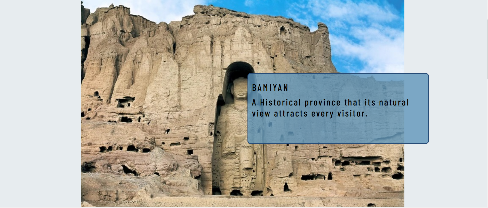

# Visit Bamiyan, Afghanistan
The Bamiyan, Afghanistan website is designed for tourists who are interested in visiting historical places. Users of this website will be able to find all the needed information about Bamiyan. The must-see places, contact information, and Social media links are added to this page.

View Bamiyan, Afghanisatn webpage
[Click Here](https://github.com)

# Tablel of Contents

- UX
  - Site Purpose
  - Site Goal
  - Requirements
  - Design
    - colors
    - Typography
    - Images
- Features
  - Existing Features
    - Header With Webpage Name and Navigation Bar Section
    - Home Page Main Image Section
    - Must See Places Section
    - Boda Statics
    - Band-e Amir
    - Footer Section
- Technologies Used
- Testing
  - Validator Testing
  - Unfixed Bugs
- Deployment
- Media

# Site Purpose
The pupose of this webpage is to share information about this historical province that is located in Afghanistan. It is intact and has a natural apperance.
# Site Goal
This site is designed for its visitors to get to know the beautiful and historical province of Bamiyan and the Buddha staues and the Band-e Amir dam that is located there.
# Requirements
This is a responsive webpage that I have created by using the technologies that I have learned. The development process needs to be well documented through a version control system such as GitHub. 
It is created using HTML and CSS.

# Design
This is the first webpage that I have worked on therfore, the design has been infuenced by the "Love Running" project.

My purpose was to design a website that includes informatin about this historical province named Bamiyan. And to let users know what can they do at this place. Why it attracts the attention of viewers.

The navigation menu is on the top of the webpage and the website is devided into many sections. The links to the social networks is addded to the bottom of the page.

Colors

The color palette was created using [Coolors](https://coolors.co
)

Typography 

The [Barlow Condensed](https://fonts.google.com/specimen/Barlow+Condensed) was is chosen as the main font with a fallback of sans-serif. The font-weight of 300 is used.

Images 

Images have been chosen according to color and content. The images have been sized to match the design of the page. Images that are used in this webpage was taken from [google/Bamiyan images](https://www.google.com/search?q=bamyan+province&rlz=1C1GCEO_enDE1038DE1038&sxsrf=AJOqlzXR9617eb_IUbHaqAuZN_z1Y2-wVQ:1679244354676&source=lnms&tbm=isch&sa=X&ved=2ahUKEwigmoHauOj9AhU6RPEDHerkBWcQ_AUoAXoECAEQAw&biw=1280&bih=544&dpr=1.5)

# Features
The Bamiyan, Afghanistan webpage is a  webpage and a contact page.
- Header(Navigation Bar)
- Home Page Main Image
- Boddhas Statics
- Band-e Amir Dam
- Footer

The navigation bar is on the top of the page to make it easier for the users to access differents sections of the page.

# Existing Features

Header With Webpage Name and Navigation Bar Section

- The header consists of a Name section that is aligned to the left and Links that is aligned to the right.
- The navigation bar includes links to the Home page, Best places, and Contact that allow users to access each of them easily.
- The header is on the top of the page.

Home Page Main Image Section

- This section shows the name of the place and country where it is located.
- The image shows the historical Salsal Static.
- This section also includes an h2 and p elements that declare what the webpage is about.

# Must See Places

In this part, the most historical and beautiful places are added.

Buddhasas of Bamiyan

  - This section contains two boxes, with an image, and a heading and paragraph.
  - In this section users will know Boddhas names, their heights, location,how old they are and the year which they were destroyed.
  - Image shows that Bodhas are carved in the hearth of the mountain.

Band-e Amir National Park

In this part Band-e Amir dam is introduced as a tourist attraction.
  - This section contains a box, with an image, and a heading and paragraph.
  - The pupose of this part is to let the users know what a beautiful place it is.
  - In this part users will know that Band-e Amir dam is a tourist attraction, the national park consists of six lakes.
  - Image shows the Band-e Amir dam view.

Footer

- Footer contains four social media links (Facehook, Twitter, Instagram and Youtube)
- This section includes links that help users to access social medial platforms easily.

# Technologies Used
- HTML
- CSS

# Testing
List of the main issues
1. In the idex.html file the width of images for Boddhas and Band-e Amir section was set with percentage and while validating the code with W3C Validator it caused an error.
- Solution: Removed the percentag and set the value with pixels.
2. The color of heading was not visible.
- Solution: Changed colors by using Coolers that match the whole page.
3. 
Apart from these issues that I mentioned there have been several minor issues. The majority of these issues have been due to miss spelled tags, attributes, closing tag, and other mistakes.

Validator Testing
- HTML
- CSS

  - No errors were when passing through the official[Jigsaw validator](https://jigsaw.w3.org/css-validator/validator#warnings)

- lighthouse testing

# Bugs
# Validator Testing
# Deployment

