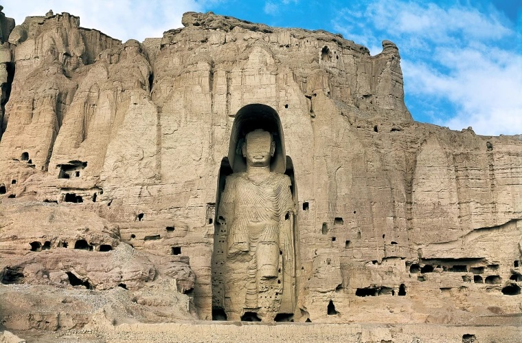

# Visit Bamiyan, Afghanistan
The Bamiyan, Afghanistan website is designed for tourists who are interested in visiting historical places. Users of this website will be able to find all the needed information about Bamiyan. The must-see places, things to do in Bamiyan, contact information, and Social media links are added to this page.

View Bamiyan, Afghanisatn webpage
[Click Here](https://github.com)

# Tablel of Contents

- UX
  - Site Purpose
  - Site Goal
  - Requirements
  - Design
    - colors
    - Typography
    - Images
- Features
  - Existing Features
    - Header With Webpage Name and Navigation Bar Section
    - Home Page Main Image Section
    - Must See Places Section
      - Boda Statics
      - Band-e Amir
    - Things to Do Section
    - Footer Section
- Technologies Used
- Testing
  - Validator Testing
  - Unfixed Bugs
- Deployment
- Media

# Site Purpose
The pupose of this webpage is to share information about this historical province that is located in Afghanistan. It is intact and has a natural apperance.
# Site Goal
This site is designed for its visitors to get to know the beautiful and historical province of Bamiyan and the Buddha staues and the Band-e Amir dam that is located there.
# Requirements
This is a responsive webpage that I have created by using the technologies that I have learned. The development process needs to be well documented through a version control system such as GitHub. 
It is created using HTML and CSS.

# Design
This is the first webpage that I have worked on therfore, the design has been infuenced by the "Love Running" project.

My purpose was to design a website that includes informatin about this historical province named Bamiyan. And to let users know what can they do at this place. Why it attracts the attention of viewers.

The navigation menu is on the top of the webpage and the website is devided into many sections. The links to the social networks is addded to the bottom of the page.

Colors

The color palette was created using ....

Typography 

The Barlow Condensed was is chosen as the main font with a fallback of sans-serif.

Images 

Images have been chosen according to color and content. The images have been sized to match the design of the page.

# Features
The Bamiyan, Afghanistan webpage is a two webpage and a contact page.
- Header(Navigation Bar)
- Home Page Main Image
- Must See Places
- Things to do
- Footer
The navigation bar is on the top of the page to make it easier for the users to access differents sections of the page.

# Existing Features

Header With Webpage Name and Navigation Bar Section
- The header consists of a Name section that is aligned to the left and Links that is aligned to the right.
- The navigation bar includes links to the Home page, Best places, and Contact that allow users to access each of them easily.
- The header is on the top of the page.

Home Page Main Image Section

- 

### Navigation:
- the navigation link Visit Bamiyan, Afghanistan at the top left is linked to the web homepage.
- The other links o the top right side are linked to home, must see places , things to do and contact.
- The navigation menu shows the name of the website and other links that makes it easy for the user to access different section of the page.

screenshot should be added

### Header:
- The header shows the name of the place and country where it is located.
- A short introduction which expresses that its natural view attracts the attention of every visitors.
- An image of Bamiyan is added to it.

screenshot should be added
## Must See Places:

In this section the most historical and beautiful places are added.

### Boddhas of Bamiyan:
Bamiyan's two Boddhas are named Salsal and Shamama.
- They are masterpieces of Buddhism.
- Bodhas are carved in the hearth of mountain.
- These two statues have been registered as wonders of the world by UNESCO.
- They were destroyed by Taliban in 2001.

### Band-e Amir National Park:
Besides these two statues, Band Amir is also a tourist attraction.
- Band-e Amir consists of six lakes.
- named the first national park of Afghanistan in 2009.

screenshot should be added 

### Contact Information:
This section enables users to communicate with me if further information is needed.
- follow me on Instagram, Youtube, and Twitter.

screenshot should be added

### Testing
### Bugs
### Validator Testing
### Deployment

