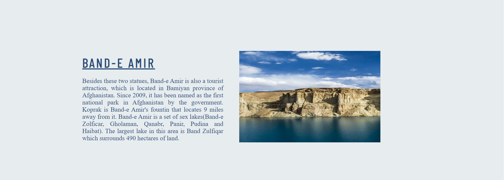

# Visit Bamiyan Afghanistan

The Bamiyan, Afghanistan website is designed for tourists who are interested in visiting historical places. Users of this website will be able to find all the needed information about Bamiyan. The must-see places that are Boddhas Statics and Band-e Amir and also Social media links are added to this page.

Requirements for the project is that the website has to be static and responsive using HTML5 and CSS3.

A live version of the project can be found here - 
https://saleha-m14.github.io/BAMIYAN-MY-1PROJECT/

# Tablel of Contents

+ [UX](#ux "UX")
  + [User Demographic](#user-demographic "User Demographic")
  + [Site Purpose](#site-purpose "Site Purpose")
  + [Site Goal](#site-goal "Site goal")
  + [Requirements](#requirements "Requirements")
  + [Design](#design "Design")
    + [Colors](#colors "Colors")
    + [Typography](#typography "Typography")
    + [Images](#images "Images")
+ [Features](#features "Features")
  + [Existing Features](#existing-features "Existing Features")
    + [Header With Webpage Name and Navigation Bar Section](#header-with-webpage-name-and-navigation-bar-section "Header With Webpage Name and Navigation Bar Section")
    - [Home Page Main Image Section](#home-page-main-image-section "Home Page Main Image Section")
    - [Boddha Statics](#boddha-statics "Boddha Statics")
    - [Band-e Amir](#band-e-amir "Band-e Amir")
    - [Video](#video "video")
    - [Footer](#footer "Footer")
- [Technologies Used](#technologies-used "Technologies Used")
- [Testing](#testing "Testing")
  - [Validator Testing](#validator-testing "Validator Testing")
  - [Unfixed Bugs](#unfixed-bugs "Unfixed Bugs")
- [Deployment \& Usage](#deployment--usage)
  - [Remote Deployment](#remote-deployment)
  - [How To Fork](#how-to-fork)
  - [How To Clone](#how-to-clone)
- [Media](#media "Media")

## UX

### User Demographic

This website is dedicated to:

 - Tourists who are intrested to visit Afghanistan.
 - People around the world that likes to see historical places.
 - Those who wants to know more about Bamiyan.

### Site Purpose

The purpose of this webpage is to share information about this historical province that is located in Afghanistan. It is intact and has a natural appearance.

### Site Goal

This site is designed for its visitors to get to know the beautiful and historical province of Bamiyan and the Buddha staues and the Band-e Amir dam that is located there.

### Requirements

This is a responsive webpage that I have created by using the technologies that I have learned. The development process needs to be well documented through a version control system such as GitHub. 
It is created using HTML and CSS.

### Design

This is the first webpage that I have worked on therfore, the design has been infuenced by the "Love Running" project.

My purpose was to design a website that includes informatin about this historical province named Bamiyan. And to let users know what can they do at this place. Why it attracts the attention of viewers.

The navigation menu is on the top of the webpage and the website is devided into many sections. The links to the social networks is addded to the bottom of the page.

#### Colors

The color palette was created using [Coolors](https://coolors.co
)

#### Typography 

The [Barlow Condensed](https://fonts.google.com/specimen/Barlow+Condensed) was is chosen as the main font with a fallback of sans-serif. The font-weight of 300 is used.

#### Images 

Images have been chosen according to color and content. The images have been sized to match the design of the page. Images that are used in this webpage was taken from [google/Bamiyan images](https://www.google.com/search?q=bamyan+province&rlz=1C1GCEO_enDE1038DE1038&sxsrf=AJOqlzXR9617eb_IUbHaqAuZN_z1Y2-wVQ:1679244354676&source=lnms&tbm=isch&sa=X&ved=2ahUKEwigmoHauOj9AhU6RPEDHerkBWcQ_AUoAXoECAEQAw&biw=1280&bih=544&dpr=1.5)

## Features

The Bamiyan, Afghanistan webpage is a single webpage and that contains a header, four sections and a footer.

- Header(Navigation Bar)
- Home Page Main Image
- Boddhas Statics
- Band-e Amir Dam
- Video
- Footer

The navigation bar is on the top of the page to make it easier for the users to access differents sections of the page.

## Existing Features

#### Header With Webpage Name and Navigation Bar Section

- The header consists of a Name section that is aligned to the left and Links that is aligned to the right.
- The navigation bar includes links to the Home page, Boddhas Statics, Band-e Amir, and video that allow users to access each of them easily.
- The header is on the top of the page.

#### Home Page Main Image Section

- This section shows the name of the place and declares that it is historical.
- The image shows the historical Salsal Static.
- This section also includes an h2 and p elements that declare what the webpage is about.

#### Buddhasas of Bamiyan

  - In this section the historic Boddhas Statics are added
  - This section contains two boxes, with an image, and a heading and paragraph.
  - In this section users will know Boddhas names, their heights, location,how old they are and the year which they were destroyed.
  - Image shows that Bodhas are carved in the hearth of the mountain.

#### Band-e Amir National Park

In this part Band-e Amir dam is introduced as a tourist attraction. 

  - This section contains a box, with an image, and a heading and paragraph.
  - The pupose of this part is to let the users know what a beautiful place it is.
  - In this part users will know that Band-e Amir dam is a tourist attraction, and the national park consists of six lakes.
  - Image shows the Band-e Amir dam view.

#### Video

In this section, a video of the Bamiyan province of Afghanistan is added. In this video, users can see all the places that are introduced in this section. This video represents the natural view of Bamiyan.

#### Footer

- Footer contains three social media links (Facebook, Twitter, and Youtube)
- This section includes links that help users to access social medial platforms easily.
- The color of this section is completly different from other parts.

### Technologies Used

- HTML
- CSS

### Testing

List of the main issues:

1. In the idex.html file the width and height attributes were added for the images of the Boddhas and Band-e Amir section and while validating the code with W3C Validator it caused an error.
- Solution: Removed the width and height attributes from index.html and added the width and height for images in style.css.
2. The color of heading was not visible.
- Solution: Changed colors by using Coolers that match the whole page.
3. There was an error that said the fourth section lacks heading.
- Added heading and div to that section.
4. The second and third section of webpage was not responsive to smaller devices.
- Solution: On the style.css media query was added to be responsive to smaller devices.
5.

Apart from these issues that I mentioned there have been several minor issues. The majority of these issues have been due to miss spelled tags, attributes, closing tag, and other mistakes.

### Validator Testing

- HTML
  - No errors were returned when passing through the official [W3C Validator](https://validator.w3.org/nu/?doc=https%3A%2F%2Fangelicaguimaraes.github.io%2Fmagnolia_tree%2Findex.html)

- CSS
  - No errors were returned when passing through the official [(Jigsaw validator)](http://jigsaw.w3.org/css-validator/validator?lang=en&profile=css3svg&uri=https%3A%2F%2Fangelicaguimaraes.github.io%2Fmagnolia_tree%2Findex.html&usermedium=all&vextwarning=&warning=1)

- lighthouse testing

### Unfixed Bugs

- All bugs were fixed and added to testing.

## Deployment & Usage

### Remote Deployment
The site was deployed to GitHub pages. To deploy the website, the following steps were taken:
* In the GitHub repository, navigate to the Settings tab
* On the left side menu, on the section Code and automation, click on Pages.
* From the source section drop-down menu, select the Deploy from a branch.
* From the branch section drop-down menu, select main, right on the side select /root.
* Once the the branch menus have been selected, github will create the page. It might take a few minutes. Once it is done a link will show up on the top of the page.

### How To Fork
To fork the repository:
* Log in (or sign up) to [Github](https://github.com/).
* Go to the repository for this project: [Fem Code](https://github.com/panzek/fem-code).
* Click the Fork button in the top right corner.

### How To Clone

To clone the repository:
* Log in (or sign up) to [Github](https://github.com/).
* Go to the repository for this project: [Fem Code](https://github.com/panzek/fem-code).
* Click on the code button, select whether you would like to clone with HTTPS, SSH or GitHub CLI and copy the link shown.
* Open the terminal in your code editor and change the current working directory to the location you want to use for the cloned directory.
* Type 'git clone' into the terminal and then paste the link you copied in step 3.
* Press enter.

 

The live version of the project is deployed at GitHub pages.

The procedure for deployment followed the "Creating your site" steps provided in [GitHub Docs.](https://docs.github.com/en/pages/getting-started-with-github-pages/creating-a-github-pages-site)

1. Log into GitHub.
2. Locate the GitHub Repository that shall be deployed live.
3. At the top of the repository, select Settings from the menu items.
4. Scroll down the Settings page to the ”GitHub Pages" section and click on the ”Check it out here!”
5. At the ”Source” section choose ”main” as Branch and root as folder and click ”Save”
6. The website will deploy and the pages refreshes to provide the live link to the project.

The live link can be found here - https://saleha-m14.github.io/BAMIYAN-MY-1PROJECT/

## Content

- The design of the project is inspired by Code Institutes ”Love Running” project. The context of the page is written by the author.

## Media

- All images were downloaded from [google/Bamiyan images](https://www.google.com/search?q=bamyan+province&rlz=1C1GCEO_enDE1038DE1038&sxsrf=AJOqlzXR9617eb_IUbHaqAuZN_z1Y2-wVQ:1679244354676&source=lnms&tbm=isch&sa=X&ved=2ahUKEwigmoHauOj9AhU6RPEDHerkBWcQ_AUoAXoECAEQAw&biw=1280&bih=544&dpr=1.5)
.

[Back to top](#visit-bamiyan-afghanistan)

